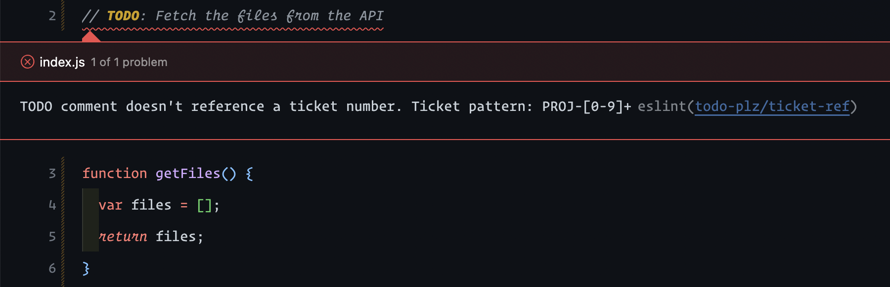

# eslint-plugin-todo-plz

Enforce consistent and maintainable TODO comments.



## Installation

You'll first need to install [ESLint](http://eslint.org):

```
$ npm i eslint --save-dev
```

Next, install `eslint-plugin-todo-plz`:

```
$ npm install eslint-plugin-todo-plz --save-dev
```

## Usage

Import `eslint-plugin-todo-plz` in your `eslint.config.js`, register it under
`plugins`, and configure the rules you want to use:

```js
const todoPlz = require("eslint-plugin-todo-plz");

module.exports = [
  {
    plugins: {
      "todo-plz": todoPlz,
    },
    rules: {
      "todo-plz/ticket-ref": ["error", { pattern: "PROJ-[0-9]+" }],
    },
  },
];
```

## Supported Rules

- [`ticket-ref`](docs/rules/ticket-ref.md)

## Inspiration

- Shoutout [`expiring-todo-comments`](https://github.com/sindresorhus/eslint-plugin-unicorn/blob/master/docs/rules/expiring-todo-comments.md) for showing me how to build my first ESLint rule.
